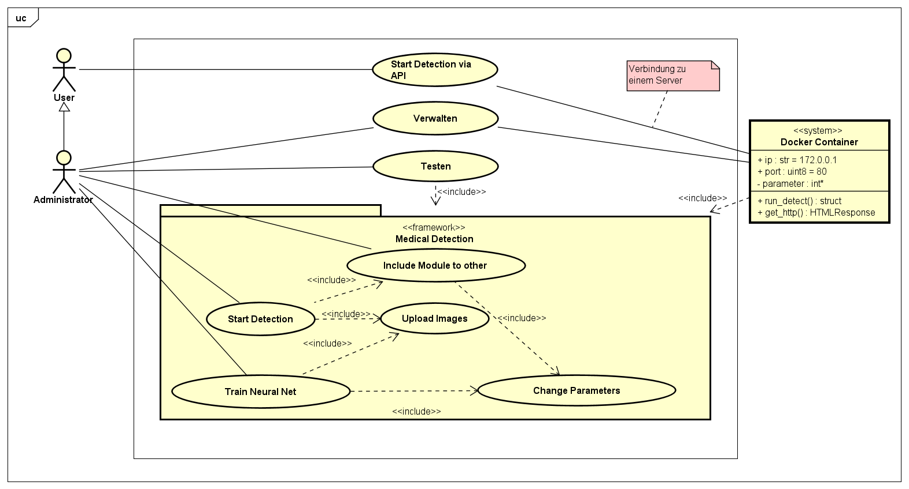
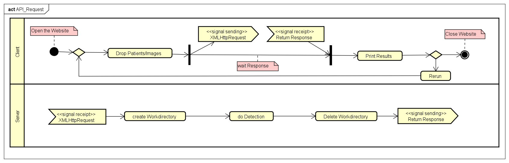

   

# DE: Graduierung von Fazialisparesen durch Methoden des Maschinellen Lernens v0.1.0

##### EN: Grading of Facial Palsy by Machine Learning methods v0.1.0

## Thesis TODO and INFOS
- Until final Date
   1. generate Poster
- FINAL DATE (2x Thesis with CD)
   1. PDF of Thesis
   2. Teaser Picture
   3. Copy of Pages where i citate from (document/docs or document/ePaper)
   4. images (document/thesis/images)
   5. Source Code (copy of gitlab repro)
- Use Vector graphics
- UML Diagrams (sequence diagram, ...)

## Project

#### Install
clone Repository and install Dependencies  
or  
let the Project update all Dependencies automatic if already a version is installed
~~~bash
git clone ???
cd ???
pip install -r source/requirements.txt
~~~

#### Use Cases

 

    
 

###### Training the Neural Nets:
 ~~~shell
Get Help for Command Options:
python train.py -h

STD:
python train.py --batch-size 16 --epochs 50 --source ./img --device cpu
python train.py --batch-size 16 --epochs 50 --source ./img --device 0

With external Cache:
python train.py --batch-size 16 --epochs 50 --source ./img --device cpu

Use Overdampling:
python train.py --batch-size 16 --epochs 50 --source ./img --device cpu --oversampling

Use Split Factor:
python train.py --batch-size 16 --epochs 50 --source ./img --device cpu --val-split 0.25
python train.py --batch-size 16 --epochs 50 --source ./img --device cpu --train-split 0.25
python train.py --batch-size 16 --epochs 50 --source ./img --device cpu --train-split 0.25 --val-split 0.25

python detect.py --batch-size 16 --source ./img --device 0
~~~

###### Start Detection:
 ~~~shell
Get Help for Command Options:
python detect.py -h

STD:
python detect.py --batch-size 16 --source ./img --device cpu
python detect.py --batch-size 16 --source ./img --device 0

Use Half Precision:
python detect.py --batch-size 16 --source ./img --device 0 --half

Use Converter Class -> Label:
python detect.py --batch-size 16 --source ./img --device 0 --convert

Select special Function:
python detect.py --batch-size 16 --source ./img --device 0 --function-selector symmetry
python detect.py --batch-size 16 --source ./img --device 0 --function-selector symmetry, eye
python detect.py --batch-size 16 --source ./img --device 0 --function-selector mouth, forehead,
python detect.py --batch-size 16 --source ./img --device 0 --function-selector hb_direct
~~~

###### Start API:

   

 ~~~shell
Get Help for Command Options:
python app.py -h

STD:
python detect.py --ip 127.0.0.1 --port 8080 --reload --workers 4

or with Dockerfile/docker-copmpose:
~~~

#### Structure of the Image Folder

##### For Detection

.img
├── ...
├── docs                    # Documentation files (alternatively `doc`)
│   ├── TOC.md              # Table of contents
│   ├── faq.md              # Frequently asked questions
│   ├── misc.md             # Miscellaneous information
│   ├── usage.md            # Getting started guide
│   └── ...                 # etc.
└── ...

###### Coding of the Pictures
1. Resting Face
2. Lift Eyebrown
3. Smile, closed Mouth
4. Smile, opend Mouth
5. Duckface
6. Close Eye, easy
7. Close Eye, forced
8. Wrinkle nose
9. Lower Lip Depression

<!---
1. Ruhender Gesichtsausdruck
2. Augenbrauen heben
3. Lächeln, geschlossener Mund
4. Lächeln, geöffneter Mund
5. Lippen schürzen, „Duckface"
6. Augenschluss, leicht
7. Augenschluss, forciert
8. Nase rümpfen
9. Depression Unterlippe
-->

#### Debug

Linting of all python files for a unified structure look using pylint Package

Info: [Pylint features](https://docs.pylint.org/en/1.6.0/features.html)

~~~shell
pylint source --extension-pkg-whitelist=torch --generated-members=numpy,torch --max-line-length=180 --max-attributes=10 --max-args=10 --max-locals=20
~~~
<!---
adding Reason
-->

| File                     | Function                        |   pylint disable                                   |   Reason    |
| :---                     | :----                           | :----                                              | :----       |
| detect.py                | Import                          | import-error                                       | works correct      |
| detect.py                | detect                          | too-many-arguments,   too-many-locals,   too-many-statements       | Parameters needed for direct Call as a function |
| detect.py                | main                            | unnecessary-lambda 								  | Correct Time Measurement and Parameter handling |
| train.py                 | Import                          | import-error                                       | works correct      |
| train.py                 | train                           | too-many-arguments,   too-many-locals,   too-many-statements           | Parameters needed for direct Call as a function |
| train.py                 | main                            | unnecessary-lambda 								  | Correct Time Measurement and Parameter handling |
| train.py                 | main                            | no-member                                        | Singleton Pattern |
| app.py                   | Import                          | import-error                                       | works correct      |
| app.py                   | run_detect                      | broad-except							          | General Exception is needed |
| unit_test.py             | Import                          | import-error                                       | works correct      |
| unit_test.py             | all                             | invalid-name, no-member, too-few-public-methods, no-self-use     | Unittests Testing |
|                          |                                 |      											  |             |       
| utils/argparse_utils.py  | n.a                               | n.a                                              |             |
| utils/automata.py        | Import                            | import-error                                     | works correct      |
| utils/automata.py        | one, two, three, four, five, six  | unused-argument                                  | automata spyle      |
| utils/config.py          | n.a                               | n.a                                              |             |
| utils/cutter.py          | Import                            | import-error							          | works correct |
| utils/cutter.py          | Cutter.set                        | protected-access						          | Override Framework if other device than cpu is requested |
| utils/database_utils.py  | Import                            | import-error                                     | works correct      |
| utils/dataloader.py      | Import                            | import-error							          | works correct |
| utils/dataloader.py      | transform_resize_and_to_tensor    | no-member                                        | Singleton Pattern |
| utils/dataloader.py      | LoadImages.__init__               | no-member                                        | Singleton Pattern |
| utils/dataloader.py      | LoadImages.augmentation           | no-member                                        | Singleton Pattern |
| utils/dataloader.py      | ImbalancedDatasetSampler.__init__ | super-init-not-called                            | Error of not called |
| utils/dataloader.py      | CreateDataloader                  | too-few-public-methods                           | Class is needed for function wise Oversampling |
| utils/decorators.py      | Import                            | import-error							          | works correct |
| utils/decorators.py      | try_except, try_except_none       | broad-except							          | General Exception is needed |
| utils/errorimports.py    | n.a                               | n.a                                              |             |
| utils/general.py         | Import                            | import-error							          | works correct |
| utils/general.py         | set_logging        			   | redefined-builtin               			      | For Multi GPU Logging needed to show the Rank |
| utils/general.py         | set_logging                       | no-member                                        | Singleton Pattern |
| utils/general.py         | check_requirements                | broad-except							          | General Exception is needed |
| utils/plotting.py        | Import                            | import-error							          | works correct |
| utils/plotting.py        | Plotting.update_epoch             | consider-using-dict-items					      | Does not work with dict.items  |
| utils/pytorch_utils.py   | Import                            | import-error							          | works correct |
| utils/singleton.py       | n.a                               | n.a                                              |             |
| utils/specs.py           | n.a                               | n.a                                              |             |
| utils/templates.py       | n.a                               | n.a                                              |             |

Unittest of relevant Functions using builtin Python unittest libary and pytest Package

~~~shell
pytest source/unit_test.py --color=no

or

cd source &&  python unit_test.py
~~~

## Other
#### Tools used for the Thesis & Project
- [atom.io v1.58.0](https://atom.io/)
   1. Included Git-Version-Management
   2. Package [atom-latex v0.9.1](https://atom.io/packages/atom-latex) for building the Thesis
   3. Package [language-latex v1.2.0](https://atom.io/packages/language-latex) for syntax highliting
   4. Package [platformio-ide-terminal v2.10.1](https://atom.io/packages/platformio-ide-terminal) Terminal access
- [Python v3.8.6](https://www.python.org/)
- Python Packages (look at source/requirements.txt for more informations about)
- [Inkscape v1.1.2](https://inkscape.org/)

#### Useful Linux commands

~~~shell
Disk Usage: du -h
Nvidia Gup Performance: watch -n0.5 nvidia-smi
CPU Performance: htop
~~~

TODO-LIST

###### Training
- [x] OptimizerClass/SchedulerClass to functions
   1. [x] Adding Scheduler to list
   2. [x] Make it available via argparse
   3. [x] Expand list
   4. [x] Chain Schedulers / Chain Schedulers sequential
   5. [x] How to set the Parameter (Concept for setting these is needed)
   6. [x] via File
   7. [x] sequential option via file
- [x] Dataloader
   1. [x] Adding Dataloader Class
   2. [x] Gather Data from the images
      - [x] Symmetry Cutting
      - [x] Eye Cutting
      - [x] Mouth Cutting
      - [x] Forehead Cutting
   3. [x] Structure of the images and labels (use template see in settings.py)
   4. [x] LoadImages Class for only loading Images
   5. [x] Augmentation for Images
   6. [x] Flipping/Invert Image as Augmentation
- [x] Training function for epochs
- [x] Validation of training (see Plotting)
- [x] DataParralell and DistributedDataParrallel for faster traning
- [x] Dataloader Sampler for DP and DDP

###### Detection
- [x] Input for the System (Single Patient, list of Patients, list of Patients by Category)
- [ ] Input single Picture ??
- [x] Prediction interpreter
- [x] Decision Tree for the Grading  or Automata[Example Tree](https://www.datacamp.com/community/tutorials/decision-tree-classification-python)
- [x] output result list

###### Other
- [x] Train/Validation Split
- [x] Model save/load without overwriting data
- [ ] num_workers = min([os.cpu_count(), batch_size if batch_size > 1 else 1, workers]) maybe Issue with Windows [?? Solution](https://github.com/pytorch/vision/issues/689)
- [x] Caching Images via SQLite3
- [ ] Optimizing Code via Numba and Lru-Cache especially frequently used functions and with [memoization](https://github.com/lonelyenvoy/python-memoization)
- [ ] Plotting Results from training/validation
   1. [x] Class for Plotting
   2. [x] for each Category of HB
   3. [x] loss, accurancy (AverageMeter --> To Plotting Class)
   4. [x] [confusion matrix](https://deeplizard.com/learn/video/0LhiS6yu2qQ)
   5. [x] [precison/recall](https://builtin.com/data-science/precision-and-recall)
- [ ] Linting and Unittests
   1. [ ] Linting Code and write all #pylint: disable to a list
   2. [ ] Write Unittest code for all relevant Functions
- [ ] Adding & Checking Docstring's in all files and functions
   1. [ ] Header Docstring (Author, file name, License)
   2. [ ] Function Docstring
- [ ] [Python Package generation](https://packaging.python.org/tutorials/packaging-projects/)
- [ ] API Access via docker-compose/Dockerfile and FastAPI
- [ ] Add License (e.g. GNU General Public License v3.0)
- [ ] Jupyter lab for vizualizing training and testing as tutorial
- [ ] [Tips](https://towardsdatascience.com/7-tips-for-squeezing-maximum-performance-from-pytorch-ca4a40951259)

